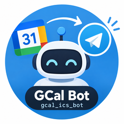

# gcal-bot



Telegram bot that reads events from a Google Calendar iCal feed and posts
reminders to a Telegram group before each event starts — with Yes/No/Maybe
RSVP buttons, live participant list in the message. Supports multiple
reminders per event (e.g. 24h, 1h, 15m before). One bot can serve many
groups, each with its own calendar — every group sets itself up with
`/onboard`, no Home Assistant config needed per group. Runs as a **Home
Assistant add-on** (Supervisor), no manual Docker juggling needed.

The bot also posts a welcome message with a quick how-to whenever it's added
to a new group (and replies with the same text to `/start`).

## Commands

- `/onboard <ical-url>` — connect this group to a calendar (run once per
  group); shows instructions if called without a URL
- `/next` — list upcoming events; tap one to see its details and set your RSVP
- `/remind` — show the reminder schedule for this group; `/remind 24h 1h 15m`
  changes it, `/remind reset` goes back to the add-on's default
- `/status` — whether this group is set up, last calendar check, current
  config

Register them with BotFather via `/setcommands` so they show up in the "/"
menu:
```
onboard - Connect this group to a calendar
next - Show upcoming events
remind - View or change the reminder schedule
status - Show bot status
```

## Rescheduling an event

Move the event in Google Calendar — the bot picks it up on its next poll
(`poll_interval_minutes`). If the event was already posted in the group or
someone RSVPed, it posts a "📅 Rescheduled (was …)" notice, updates the old
messages to the new time and keeps everyone's RSVPs. Reminders follow the
new time. The bot can't move events itself: the iCal feed is read-only.

## Setup

### 1. Create a Telegram bot
1. Chat with [@BotFather](https://t.me/BotFather), `/newbot`, note the token
   → that's the only secret the add-on itself needs.
2. Add the bot to the group, give it the "send messages" admin right.

### 2. Connect a group to a calendar
In Google Calendar: Settings → the calendar you want → "Secret address in
iCal format" → copy it (keep it secret — anyone with the link sees every
event). Then in the Telegram group:
```
/onboard https://calendar.google.com/calendar/ical/xxx%40group.calendar.google.com/private-xxxx/basic.ics
```
The bot validates the URL immediately and confirms. Repeat `/onboard` in
every group that should get reminders — each group can point at a different
calendar. Running it again in the same group replaces the calendar
(a dedicated `/edit` for multiple calendars per group is planned, not built
yet).

## Install as a Home Assistant add-on

This repo is a Home Assistant add-on repository, so HA pulls new versions
itself — no copying files to the Pi.

1. **Settings → Add-ons → Add-on Store → top-right "⋮" → Repositories** →
   add `https://github.com/christoph-teichmeister/gcal-bot`
2. "GCal Bot" shows up in the store → install it
3. **Configuration** tab: fill in `bot_token` (plus optionally
   `poll_interval_minutes`, `lookahead_days`). The default reminder schedule
   (24h before) and per-group calendars are configured via Telegram, not here
   — see `/remind` and `/onboard` below.
4. **Info** tab → Start, enable "Start on boot"
5. Run `/onboard <ical-url>` in each group that should use the bot

Logs are visible right in the add-on's "Log" tab.

### Updates
A new version is released by bumping `version` in `gcal_bot/config.yaml`
(plus an entry in `gcal_bot/CHANGELOG.md`) on `main`. HA checks the
repository periodically; to check right away: Add-on Store → "⋮" → "Check for
updates". The add-on then shows an "Update" button with the changelog.
Settings, onboarded groups and RSVPs live in the add-on's `/data` and survive
updates.

### Switching from the old local add-on
Earlier versions were installed by copying the repo to `/addons/` on the Pi.
HA treats the repository add-on as a *different* add-on with its own `/data`,
so after switching: run `/onboard` again in each group and re-set `/remind`
if you changed it; RSVPs on upcoming events start empty. Uninstall the local
add-on (and delete `/addons/gcal-bot`) before starting the new one — two
running copies with the same bot token would fight over Telegram updates.

### Local development add-on
Copying just the add-on folder still works for testing unreleased changes:
`scp -r gcal_bot homeassistant:/addons/`, then reload the store and install
it from "Local add-ons"; after further changes `scp` again and hit
"Rebuild".

## Test locally (without HA)

```bash
cd gcal_bot
python -m venv .venv && source .venv/bin/activate
pip install -r requirements.txt
export BOT_TOKEN=...
python -m bot.main
# then run /onboard <ical-url> in whichever group/chat you're testing with
```
